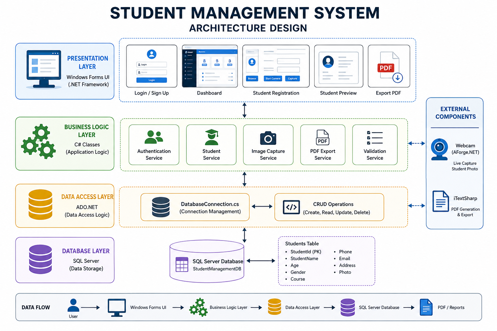
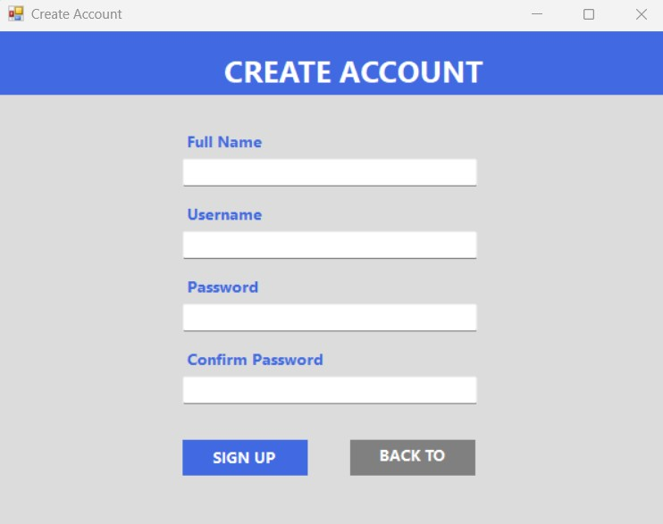
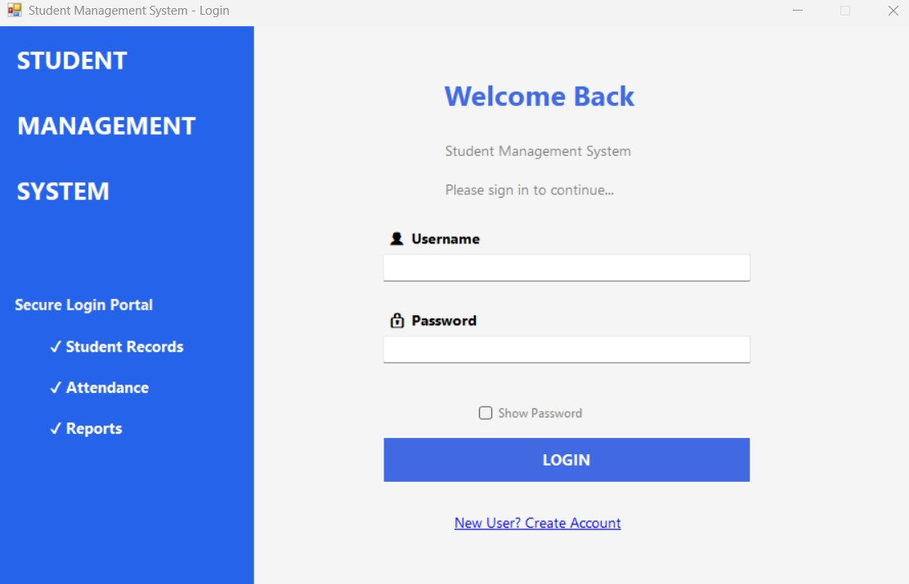
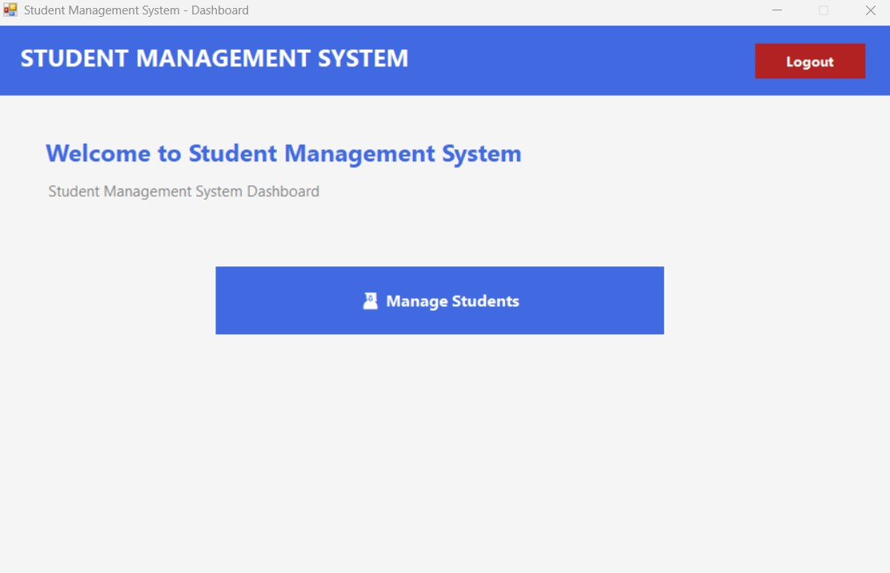
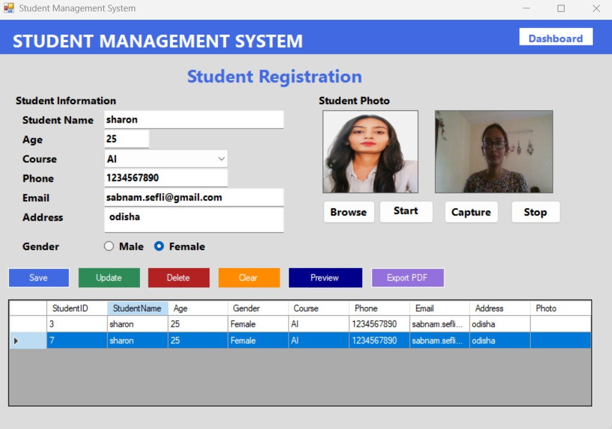
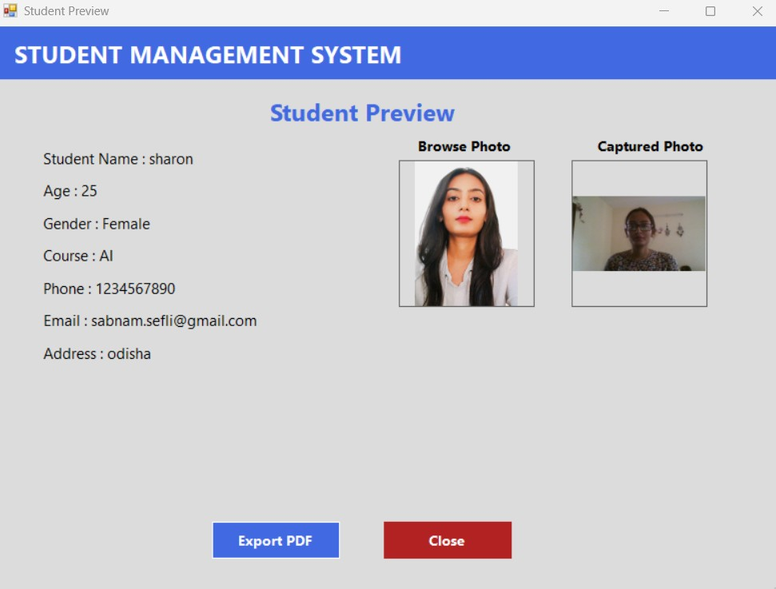
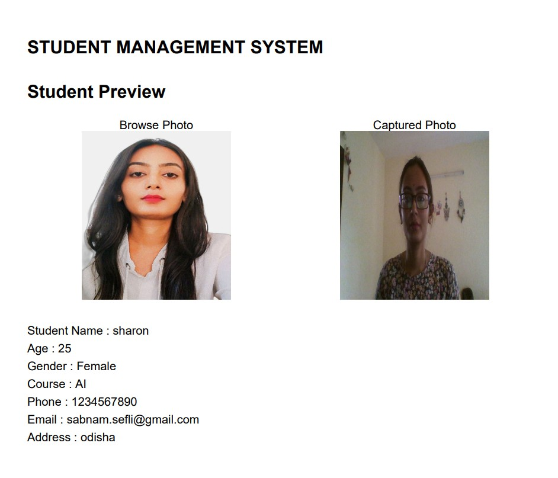
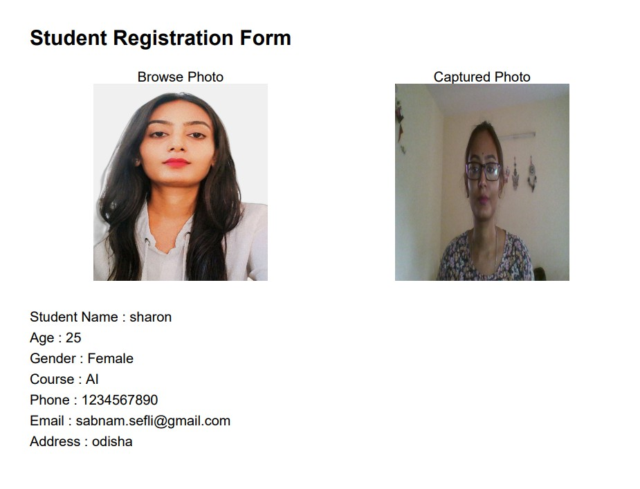

#  Student Management System

---

#  Overview

The **Student Management System** is a desktop application developed using **C# Windows Forms (.NET Framework)** and **SQL Server**. It provides a complete solution for managing student information with secure authentication, live webcam photo capture, image browsing, student preview, PDF export, and full CRUD functionality.

This project demonstrates the practical implementation of Windows Forms, ADO.NET, SQL Server integration, webcam handling, and PDF generation in a real-world desktop application.

---
<p align="center">


</p>
---

#  System Architecture

The following architecture illustrates the overall workflow and layered design of the Student Management System, including the presentation layer, business logic, data access, SQL Server database, webcam integration, and PDF export functionality.

<p align="center">
    
</p>

---


#  Features

##  User Authentication

- User Registration (Sign Up)
- User Login
- Secure authentication
- Input validation

---

##  Student Management

- Add Student
- Update Student
- Delete Student
- View Student Records
- Clear Form
- DataGridView Integration

---

##  Image Management

- Browse Student Photo
- Live Webcam Preview
- Start Camera
- Capture Image
- Stop Camera
- Display Captured Photo

---

##  Preview Window

- Preview Student Details
- Display Browse Image
- Display Captured Image
- Verify information before exporting

---

##  PDF Export

- Export Student Details
- Include Browse Photo
- Include Captured Photo
- Professional PDF Layout
- Save to Local Machine

---

##  Dashboard

- Central Navigation Panel
- Easy Access to Modules

---

#  Technologies Used

| Technology | Description |
|------------|-------------|
| C# | Programming Language |
| Windows Forms | Desktop UI Framework |
| .NET Framework | Application Framework |
| SQL Server | Database |
| ADO.NET | Database Connectivity |
| AForge.NET | Webcam Integration |
| iTextSharp | PDF Generation |
| Visual Studio 2026 | IDE |

---

#  NuGet Packages

Install the following packages before running the project:

```powershell
Install-Package AForge
Install-Package AForge.Video
Install-Package AForge.Video.DirectShow
Install-Package iTextSharp
```

---

#  Project Structure

```
StudentManagementSystem
│
├── Database
│   └── DatabaseConnection.cs
│
├── Forms
│   ├── LoginForm.cs
│   ├── SignupForm.cs
│   ├── Dashboard.cs
│   ├── StudentForm.cs
│   └── PreviewForm.cs
│
├── Images
│   ├── create-account.png
│   ├── login.png
│   ├── dashboard.png
│   ├── student-registration.png
│   ├── preview.png
│   └── exported-pdf.png
│
├── SQL
│   └── StudentManagementDB.sql
│
├── Program.cs
├── App.config
├── README.md
└── StudentManagementSystem.sln
```

---

#  Database Design

### Database

```
StudentManagementDB
```

### Students Table

| Column | Data Type |
|---------|-----------|
| StudentId | INT (Primary Key) |
| StudentName | NVARCHAR |
| Age | INT |
| Gender | NVARCHAR |
| Course | NVARCHAR |
| Phone | NVARCHAR |
| Email | NVARCHAR |
| Address | NVARCHAR(MAX) |
| Photo | NVARCHAR(MAX) |

---

#  Application Workflow

```
           Login / Sign Up
                  │
                  ▼
             Dashboard
                  │
                  ▼
      Student Registration Form
                  │
      ┌───────────┼───────────┐
      │           │           │
      ▼           ▼           ▼
 Browse Image  Live Camera   CRUD
                  │
                  ▼
          Student Preview
                  │
                  ▼
            Export PDF
```

---

#  Application Screenshots

##  Create Account

<p align="center">

</p>

---

##  Login Page

<p align="center">

</p>

---

##  Dashboard

<p align="center">

</p>

---

##  Student Registration

<p align="center">

</p>

---

##  Student Preview

<p align="center">

</p>

---

##  Exported PDF

<p align="center">

</p>
---

##  Final Exported PDF

<p align="center">

</p>


---

#  Key Highlights

- Modern Windows Forms Interface
- SQL Server Database Integration
- Secure Login System
- Complete CRUD Operations
- Live Webcam Support
- Image Browsing
- Student Preview
- Professional PDF Export
- Exception Handling
- Input Validation
- Clean UI Design
- Easy-to-Understand Code Structure

---

#  How to Run

## 1. Clone Repository

```bash
[(https://github.com/SefaliSabnam/StudentManagementSystem.git)]
```

---

## 2. Open Project

Open the solution in **Visual Studio 2026**.

---

## 3. Restore NuGet Packages

```
Tools
→ NuGet Package Manager
→ Restore Packages
```

---

## 4. Create Database

Create a SQL Server database named:

```
StudentManagementDB
```

Execute the SQL script located in the **SQL** folder.

---

## 5. Configure Connection String

Update the SQL Server connection string inside:

```
App.config
```

---

## 6. Build Solution

```
Build
→ Build Solution
```

---

## 7. Run

Press

```
F5
```

---

#  Future Improvements

- Student Search
- Attendance Management
- QR Code Student ID
- Face Recognition
- Excel Export
- Email Notifications
- Cloud Database Integration
- Dark Mode
- User Roles (Admin / Staff)
- Reports & Analytics

---

#  License

This project is licensed under the **MIT License**.

You are free to use, modify, and distribute this project for educational and personal purposes.

---

#  Author

**Sefali**

GitHub: https://github.com/SefaliSabnam


---

#  Support

If you found this project helpful, please consider giving it a **Star ⭐** on GitHub.

It helps others discover the project and supports future improvements.

---

<p align="center">

**Made with ❤️ using C#, Windows Forms, SQL Server & Visual Studio**

</p>
